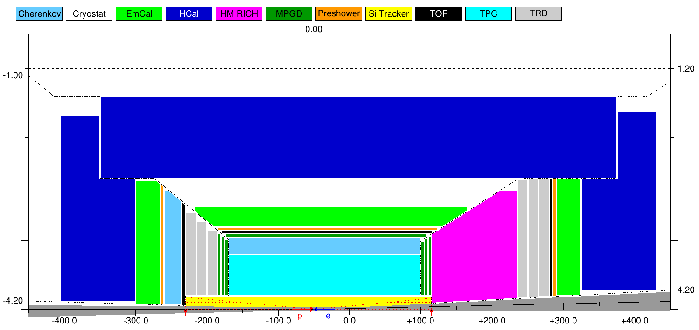
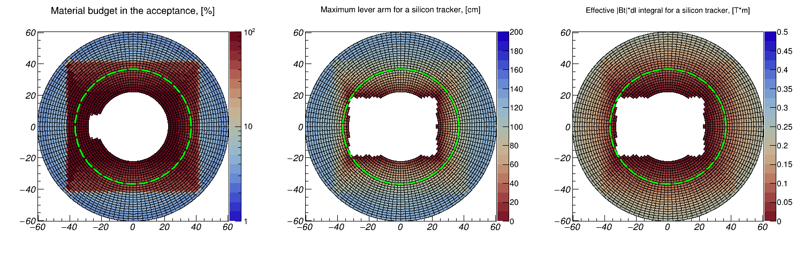

EIC Toy Model (ETM)
=================== 

  EicToyModel (ETM) is a C++ ROOT-based software suite for EIC Central Detector 
configuration purposes.  

 Content:

 * [Introduction](#introduction)
 * [Other features](#other-features)
 * [Model limitations](#model-limitations)
 * [Pre-requisites](#pre-requisites)
 * [Downloading](#downloading)
 * [Compiling](#compiling)
 * [Running](#running)
 * [GEANT interface](#geant-interface)
 * [CAD interface](#cad-interface)
 * [Magnetic field interface](#magnetic-field-interface)
 * [Vacuum chamber material and B*dl integral scans](#vacuum-chamber-material-and-magnetic-field-scans)
 * [ROOT macros options](#root-macro-options)


Introduction
------------

  The main objective of this software was providing the EIC community users
with a tool, which would allow them to easily (whatever easy means) create possible 
EIC detector configuration *templates* (namely, the self-consistent collections of 
3D sub-detector intergation volumes) and make use of them in the GEANT simulation 
environment.

  The integration volumes are guaranteed to not overlap either with each other (*done*)
or with the IR vacuum chamber volume (*TODO list*) within the same EIC detector 
configuration.

  They move synchronously under generic changes to the IR layout (e.g. by the 
nominal IP shift along the beam line direction and/or by a change in the acceptance
boundaries separating barrel and endap regions).

  Technically, a user has access to the parameters characterizing the shape and 
location of the integration volume to where his/her sub-detector component belongs, 
and can build the sub-detector dynamically in the respective GEANT
G4VUserDetectorConstruction::Construct() method, depending e.g. on the sub-detector 
distance from the nominal IP (*partly implemented*).


Other features
--------------

* On-disk model representation (C++ class instance .root file export/import using ROOT 
serializer).
* Dynamic generation of the detector integration volumes GEANT representation.
* Parameteric description of the IR vacuum chamber layout, representing reasonably 
well the available 25mrad crossing angle configuration as of 2020/03/20. As such it 
should be suitable for the *second IR* vacuum chamber description, even that the 
engineering drawings are not available as of yet. 
* Vacuum chamber geometry export in the GDML and ROOT TGeo formats.
* Interface to the BeastMagneticField library (BeAST field map import, as well as
import of the soon-to-become-available magnetic field maps produced by the EIC 
greenfield solenoid design team).
* Tools for the magnetic field B*dl integral evaluation and the IR vacuum chamber 
material scan.
* Export of the integration volumes as a STEP file, for the support structure and 
services engineering design purposes. 


Model limitations
-----------------

* The EIC Central Detector is assumed to be composed of exactly four non-overlapping
regions (vertex, barrel, and two endcaps).
* Sub-detector integration volumes in a 2D view of a given region are flat
objects, stacked along the electron beam line axis for the two endcaps and the normal to 
the electron beam line axis for the vertex and barrel stacks. See the picture below. 
* Far-forward "stack" (and B0 magnet in particular) can probably be added with minor
complications, but this is not considered in the present implementation.
* All stacks are organized in a "projective" geometry, which should represent a typical 
layout of a 4pi EIC Central Detector well enough at this stage. In this sense the only 
reason why a separate vertex stack exists is that its "silicon tracker volume" can 
occupy a physical area wider along the beam line than a "TPC volume" of a barrel stack.
* A "crack" between the barrel and the endcap stacks in a 2D {Z,R} view is represented by
monotonous functions in both R(Z) and Z(R) representations. "Crack" shape however can 
be configured in a rather flexible way, see examples below.

   
Pre-requisites
--------------

It is assumed that a more or less modern ROOT 6 version is installed and configured 
on the local system. 6.14.00 works. The line below is for bash shell. Replace .sh
by .csh if your shell is csh.

```
. <root-installation-directory>/bin/thisroot.sh
```

Downloading
-----------

```
git clone https://github.com/eic/EicToyModel.git
```

Compiling
---------

The library has to be installed locally. 

```
cd EicToyModel && mkdir build && cd build
cmake -Wno-dev ..

# additional cmake options:
#
# if executable(s) from the 'examples' directory will be compiled (be aware, "." works):
#   -DCMAKE_INSTALL_PREFIX=<EicToyModel-installation-directory>
#
# if your local ROOT installation was compiled with -std=c++17:
#   -DCMAKE_CXX_STANDARD=17
#
# if GEANT4 interface is required:
#   -DGEANT=YES
# if the IR vacuum chamber shape boolean cut through the integration volumes is required:
#   -DVGM=<VGM-installation-directory>
# A BUG: at present both are required to have G4 interface functional.
#
# for CAD export functionality:
#   -DOPENCASCADE=<OpenCascade-installation-directory>
#
# for magnetic field map interface:
#   -DBFIELD=<BeastMagneticField-installation-directry>
#
# Be aware that LD_LIBRARY_PATH should contain the locations of the OpenCascade,
# BeastMagneticField and VGM libraries, if the respective interfaces are compiled in;

make

# Needed only if executable(s) from the 'examples' directory will be compiled;
make install
```

Running
-------
  
Edit a script like [example.C](scripts/example.C) in the ../scripts/ directory 
according to your preferences (see full list of the available commands 
[here](doc/README.API.md)) and run it:

```
root -l ../scripts/example.C
```

A ROOT canvas will appear with a picture similar to the image below. 
 


Every colored object in this picture is a sub-detector integration volume. Association 
between ROOT RGB colors and sub-detector tags is 1:1, and (once the palette is agreed upon
by the user community) will never change, and will be exported in this color scheme
to both GEANT and CAD. Current palette is likely not optimal. It is hardcoded 
in [EtmPalette.cc](source/EtmPalette.cc).

Users can create custom detector (or detector group) tags and tag-to-color 
associations like "Calorimetry":kSpring dynamically. For the sake of consistency it may 
make sense to hardcode the "official" Yellow Report color (and detector tag) scheme though, 
after the initial evaluation and debugging stage.

A limited set of interactive commands (see the full list [here](doc/README.API.md)) 
is available. Try e.g. the following sequence with the self-explaining outcome of the 
respective commands: 

```
root [] eic->width(1200); 
root [] eic->mirror();
root [] eic->mirror(false);

# Move the IP to the center of the +/-4.5m area; depending on the actual example.C contents, 
# HCal in the forward endcap may disappear; move it back to some intermediate value;
root [] eic->ip(0);
root [] eic->ip(-30 * etm::cm);

# Vertical and horizontal plane cross cut; in the latter case the 25mrad crossing 
# angle is taken into account; 
root [] eic->vdraw();
root [] eic->hdraw();

# Remove e/m calorimeter from the backward (electron-going) endcap;
root [] eic->bck()->rm("EmCal");
# Install a 20cm deep MPGD "detector" in front of the high-momentum RICH in 
# the hadron-going endcap;
root [] eic->fwd()->insert("MPGD", 20 * etm::cm, "HM RICH");

# Save the current configuration;
root [] eic->write();
# Save example.vc.gdml file with the vacuum chamber layout; a BUG: this command 
# works properly only once per session; 
root [] eic->ExportVacuumChamber();
root [] .q
```

Re-open the produced file with the model in ROOT, if needed:

```
root -l '../scripts/reader.C("example.root")'
```

Beyond this point one can work with the model the same way as if it was created 
from scratch (see [example.C](scripts/example.C)). It is strongly recommended to use 
detector composition changing commands like rm() and insert() only as a quick tuning 
means, and once a desired configuration is found, put the respective changes
in a consistent full script, creating a given model from scratch. The reason 
is simple: this software is in the early debugging stage, and it is much more likely 
than a file format will change rather than the API of the commands will change 
(and the latter can be fixed by hand if needed anyway).

```
root [] auto eic = EicToyModel::Instance(); eic->hdraw();
```

It should be noted that if the geometry was saved using eic->write(*true*) call 
(notice 'true' argument), a naive permanent lock is applied to the contents of the binary 
ROOT file. The geometry can not be modified any longer without hacking the library
(would be a very easy task for a junior C++ programmer, but allows compliant users
to avoid introducing changes into the selected set of the officially distributed 
YR detector configuration files by mistake).


GEANT interface
---------------

If GEANT part of the functionality is required, it has to be installed and configured
on the local system. 10.05.p01 works. The line below is for bash shell. 


```
. <geant4-installation-directory>/bin/geant4.sh
```

Apart from the eic->ExportVacuumChamber() command shown above, one can create G4 
detector integration volumes on the fly, either one at a time or all of them at 
once. See a short example executable [main.cc](examples/basic/main.cc) as an example. 

The library should be configured with the -DGEANT cmake command line key (see above).

The integration volumes are currently represented as G4GenericPolycone shapes.
G4Polyhedra option will follow soon. The interface producing an asymmetric
boolean cut by the vacuum chamber shape is in the debugging stage now.

Naming convention for these volumes may require some tuning. At present e.g. a second
from the IP TRD detector volume in the forward endcap will be named as "FWD.TRD.01", 
and so on, with the stack identifiers "VTX", "MID", "BCK" and "FWD" for the vertex, 
barrel, e-endcap and h-endcap stacks, respectively, and the detector tags as hardcoded 
in [EtmPalette.cc](source/EtmPalette.cc). This may as well be irrelevant, since a user
can poll the G4VPhysicalVolume pointer for a particular detector by means of the 
EtmDetector::GetG4Volume() method.

Once a user gets access to a particular logical volume, he/she can populate this volume 
with the daughter objects, observing the usual GEANT rules and volume boundary conditions. 
Presently the local coordinate system of the G4GenericPolycone (G4Polyhedra) volumes
is defined in the following way:

* In the endcaps the volumes are "shifted to 0", and there is no 180 rotation around 
vertical axis for the electron-going endcap objects. This e.g. means (see the above picture)
that in the local G4GenericPolycone coordinate system, the upstream face of the 
e-endcap HCal will be located at +52.5cm and the downstream face at -52.5cm, where 
upstream/downstream is counted along the *electron* beam direction. In other words, 
calorimeter towers in this volume need to be placed centered at 0 along the beam line 
direction, and the container volume will be shifted to -3.5m as a whole without any rotation.

* In the vertex and the barrel stacks the G4GenericPolycone volumes are centered around
the IP rather than around their (Zmax+Zmin)/2 geometric center. In other words, an object 
placed at (0,0,0) in their local coordinate system, will be physically placed at (IP,0,0)
in the world volume.

 This way, to 
first order, whatever daughter objects are placed inside the integration volumes, 
the geometry will be consistent after moderate re-shuffling of a particular detector 
stack (say, after removing one of the TRD volumes in the hadron-going endcap, the e/m 
calorimeter behind it will be re-located to a proper place in the world volume). 

It seems to be wise to check the integration volume actual location by means of the 
available library calls, and *tune* the sub-detector geometry accordingly if needed.
For instance, populate the endcap HCal integration volume by towers depending on which 
radial space is actually available (*radial size: TODO list*).

Apparently the community may want to decide exporting *individual* GDML objects
describing the sub-detector integration volumes for a given version of the full EIC detector
geometry, therefore avoiding the dependency on either the ETM library described here 
or on the ROOT itself in the GEANT environment alltogether. Providing consistency 
between different sub-detector systems may be problematic in this case though.

The [example](examples) directory contains a couple of simple standalone code, 
with their own CMakeLists.txt files, which illustrate the usage. See the bare minimum 
GEANT example source code [here](examples/basic/main.cc).

The following sequence of commands brings up the G4 Qt window with the model, created
by 'root -l ../scripts/example.C' macro call earlier:

```
# Assuming "cmake -DGEANT=YES -DCMAKE_INSTALL_PREFIX=<EicToyModel-installation-directory> \
# -DVGM=<VGM-installation-directory>" was used during installation;
make install

cd ../examples/basic
mkdir build && cd build

# <EicToyModel-installation-directory> here is an absolute path to the ../../build 
# directory; csh users should use 'setenv' syntax instead; BUG: 64?;
export LD_LIBRARY_PATH=<EicToyModel-installation-directory>/lib:${LD_LIBRARY_PATH}
export LD_LIBRARY_PATH=<VGM-installation-directory>/lib64:${LD_LIBRARY_PATH}

cmake -Wno-dev -DETM=<EicToyModel-installation-directory> ..
make
./basic ../../../build/example.root
```

CAD interface
-------------

This interface may be useful to export the created models in a STEP format.

The code has to be compiled with a -DOPENCASCADE=\<OpenCascade-installation-dir\> cmake
flag (and obviously OpenCascade libraries must be installed on a local system). 

  7.2.0 is known to work, but the following line 

```
_Standard_API int    _Printf  (const char* theFormat, ...);
```

in the Standard_CString.hxx file should be commented out in the installation area, in order 
to avoid an apparent conflict with the ROOT Printf() call declaration.

One can either export a CAD model with all of the integration volumes at once by using 
EicToyModel::Export() method, or with a single detector volume by using EtmDetector::Export() 
method, see [README.API.md](doc/README.API.md) for more details.

One can also store a TObjString with a CAD model of all of the integration volumes in 
a .root file (see EtmDetector::Export() method parameters), where from it can be retrieved
by a separate [script](scripts/extract-cd-step.C) *without a need to have OpenCascade
libraries installed on a local system*.


Magnetic field interface
------------------------

A small [BeastMagneticField](https://eic.github.io/software/beast_magnetic_field.html) library 
is used to import BeAST model detector magnetic field map. The library has to be installed locally. 
The instructions are available [here](https://github.com/eic/BeastMagneticField). 

BeastMagneticField library is meant to be compatible with any new field maps, which a joint BNL/JLAB
magnet designer team will produce in the course of the YR/CDR work on the EIC greenfield central 
detector solenoid.

The EicToyModel library has to be configured with cmake -DBFIELD flag, see the full list of 
keys at the beginning of this README.

If the EicToyModel library is configured *without* BeastMagneticField interface, one can still 
perform the B*dl integral scans, assuming constant field, parallel to the electron beam line
axis.


Vacuum chamber material and magnetic field scans
------------------------------------------------ 

  One can perform a magnetic field scan, as well as the vacuum chamber material 
scan at small scattering angles in either e-endcap or h-endcap. This allows one to 
evaluate the potential reach in pseudo-rapidity in both endcaps, as well as to get 
an idea about the azimuthal acceptance asymmetry.

  Magnetic field scan evaluates the effective B*dl integral of the 
transverse-to-trajectory field component along the trajectory of a particle, originated 
at the nominal IP and scattered at a given pair of polar and azimuthal angles. Primary 
vertex smearing along the beam line can be specified.

  The starting point of this scan for a given set of values {z,theta,phi} is the point
where such a particle would exit the accelerator vacuum chamber.

  The end point is the most distant from the IP location of the last silicon tracker 
station, which can still be sensibly installed in this detector configuration in a given 
endcap (like in front of a first detector with a lot of material). Defining this 
location is at a discretion of the user. It can be given by a EtmDetectorStack::marker() 
method (see [API description](doc/README.API.md)) when configuring a particular endcap, 
and is indicated e.g. by small red arrows at -230cm and +115cm in the 2D picture above.

  In order to perform a scan on the detector and the vacuum chamber model contained 
in the example.root file produced earlier one can run [this script](scripts/scan.C): 

```
root -l '../scripts/scan.C("example.root")'
```

  Results of this scan are reprsented as three 2D histograms, which can either 
be displayed (see an [example](scripts/scan-viewer.C)) or extracted numerically
using conventional ROOT GetBinContents() calls:

```
root -l '../scripts/scan-viewer.C("example.scan.root")'
```
  A typical set of pictures will look like this:



  Horizontal and vertical axes on these example plots have a range of +/-60 mrad.
The 360 degree azimuthal angle scan is given for a range of pseudo-rapidities 
between -4.5 and -3.5 (electron-going endcap). A green dashed line corresponds 
to the pseudo-rapidity of -4.0 . A square outline seen in the pictures corresponds
to the profile of the aluminum portion of the beam pipe (has to be changed in the 
next iteration of the design).

  If somebody knows a way how to make DrawFrame() and a polar 2D histogram Draw() 
live together and allow one to use axis lables and proper title fonts, such an 
advice will be greatly appreciated.


ROOT macro options
------------------

Full current list of options is available [here](doc/README.API.md).