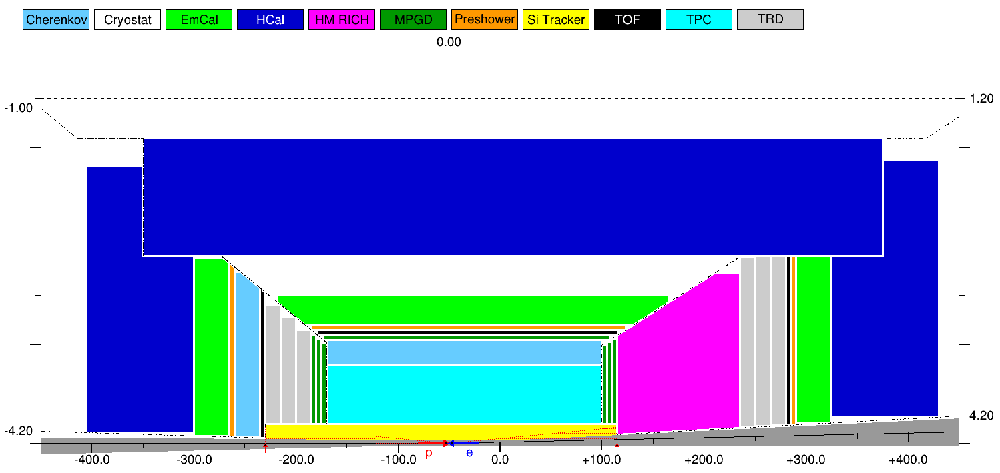

  EicToyModel is a C++ ROOT-based software suite for EIC Central Detector 
configuration. A library has to be installed locally.  

Pre-requisites
--------------

It is assumed that a more or less modern ROOT 6 version is installed and configured 
on the local system. 6.14.00 works. The line below is for bash shell. Replace .sh
by .csh if your shell is csh.

```
. <root-installation-directory>/bin/thisroot.sh
```

If GEANT part of functionality is required, GEANT has to be installed and configured
on the local system. 10.05.p01 works. The line below is for bash shell. Replace .sh
by .csh if your shell is csh.


```
. geant4.10.05.p01.build/bin/geant4.sh
```

Downloading
-----------

```
git clone https://github.com/eic/EicToyModel.git
```

Compiling
---------

```
cd EicToyModel && mkdir build && cd build
cmake -Wno-dev ..

# additional cmake options:
#
# if GEANT4 is required:
#   -DGEANT=YES
# for CAD export:
#   -DOPENCASCADE=<OpenCascade-installation-directory>
# for magnetic field map interface:
#   -DBFIELD=<BeastMagneticField-installation-directry>

make 
```

Running
-------
  
```
# Edit a script like sandbox.C according to your preferences and runs it:
root -l ../scripts/sandbox.C

# Re-open the produced file with the model if needed:
root -l '../scripts/reader.C("sandbox.root")'
```



```
# GEANT example executable (see main.cc):
./exe sandbox.root
```

ROOT macro options
------------------

Description will follow soon.